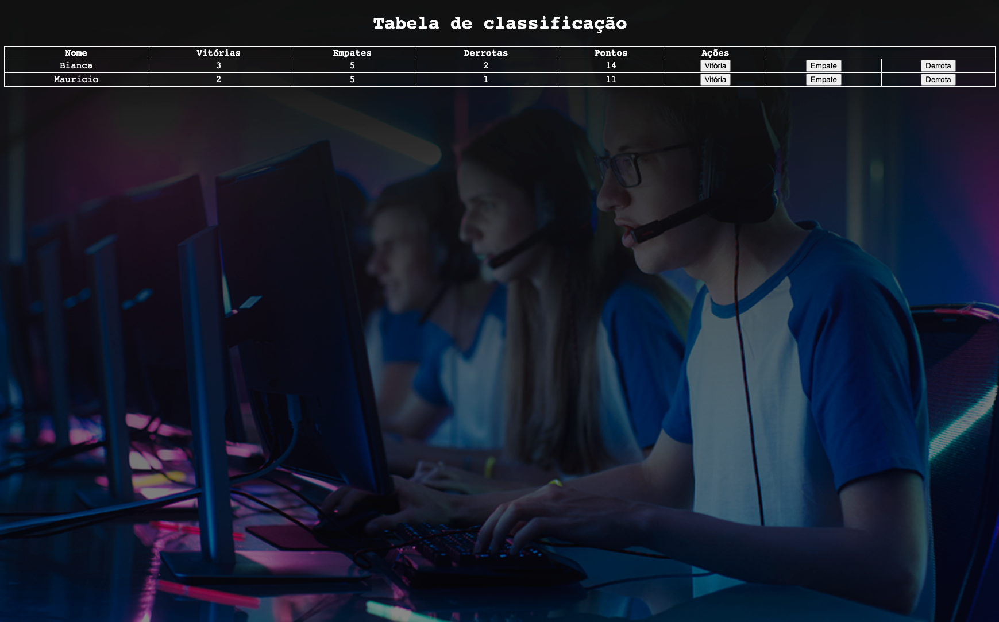

# 🏆 Tabela de classificação
### 🥇🥈🥉 Ranking table
 

📸 Screenshot

#  🚀 Technologies

- [HTML](../index.html)
- [CSS](../script.js)
- [JavaScript](../script.js)
- [Github](##github)
- [Codepen](https://codepen.io/biancamos/full/bGgwKVQ)
- [VScode](##vscode)

# 👩🏻‍💻 Project
Project made in immersion dev_ Alura's course of development for beginner.

This leaderboard project has as its main objective to develop skills with 〈table〉 〈td〉e〈thead〉〈th〉 tables and their good practices of use in everyday life.

🪄✨

PT-BR: Projeto feito em curso imersão dev_ curso de desenvolvimento para iniciante da Alura.

Este projeto da Tabela de classificação, têm como o principal objetivo desenvolver as habilidades com tabelas 〈table〉 〈td〉e〈thead〉〈th〉e suas boas práticas de uso no dia a dia. 

 #
 
                        Feito com 🤍 by BM

 #### 🔎 **[Online project here](https://codepen.io/biancamos/full/bGgwKVQ)** Projeto desenvolvido em Setembro de 2022.

